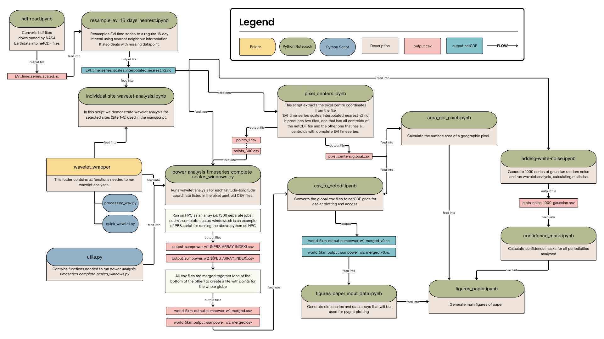

# Rhythms of Global Greening

This repository contains the full workflow used to reproduce the analyses presented in the manuscript  
**“Rhythms of Global Greening”**.

The workflow includes data from MODIS Earthdata products, timeseries preprocessing, wavelet analysis at the pixel scale, uncertainty assessment via Monte Carlo simulations, and figure generation.

A schematic overview of the full processing pipeline is provided in the flow diagram included in this repository.

For anyone interested in a self-contained demonstration of the methodology, the notebook  
**`minimal-working-example-site5-wa.ipynb`** provides a standalone example of the wavelet analysis workflow using an EVI timeseries from **Site 5**, and can be run independently of the rest of the pipeline.

Finally, the figure `flowchart.png` shows the overall structure of the code, including intermediate and final outputs, and provides guidance on the correct code's execution order.

---
## Code Overview and Structure

---

## Repository Structure

### Directories

- **`wavelets_wrapper/`**  
  Contains all custom wavelet-related functions used throughout the analysis.
  
  - `processing_wav.py`  
  - `quick_wavelet.py`

- **`gmt-palettes/`**  
  Color palette (`.cpt`) files used for plotting with **PyGMT**.

- **`site_wavelet_plots/`**  
  Output figures for **Site 1–5** as described in the manuscript.  
  Figures are generated using `individual-site-wavelet-analysis.ipynb`.

- **`sliced_csvs/`**  
  Empty, but it will contain split CSV files with pixel centroid coordinates once generated.  
  These files are generated by `pixel_centers.ipynb` and are used to parallelise the wavelet analysis on HPC.

- **`maps_of_power/`**  
  Output maps figures, e.g., normalised power change maps and confidence masks maps.  
---

## Notebooks

- **`minimal-working-example-site5-wa.ipynb`**  
  A minimal, self-contained example demonstrating the wavelet analysis workflow using an EVI timeseries from Site 5.  
  The timeseries is extracted from `EVI_time_series_scales_interpolated_nearest_v2.nc` and provided as a CSV file for convenience.  
  This notebook can be run independently of the full pipeline and serves as a lightweight reproduction of the core wavelet analysis.
  
- **`hdf-read.ipynb`**  
  Converts raw MODIS HDF files downloaded from NASA Earthdata into NetCDF format.  
  Produces a NetCDF file containing EVI timeseries for each pixel.

- **`resample_evi_16_days_nearest.ipynb`**  
  Resamples EVI timeseries to a regular 16-day interval using nearest-neighbour interpolation.  
  Also handles missing data points in the original timeseries.

- **`pixel_centers.ipynb`**  
  Extracts pixel centroid coordinates from the resampled NetCDF file.  
  Only pixels with complete (not-NAs) EVI timeseries are retained.

- **`individual-site-wavelet-analysis.ipynb`**  
  Demonstrates wavelet analysis for selected sites (Site 1–5) used in the manuscript.

- **`area_per_pixel.ipynb`**  
  Computes the surface area of each geographic pixel, accounting for latitude-dependent area variation.

- **`adding-white-noise.ipynb`**  
  Errors propagation analysis: script performs a Monte Carlo analysis of Gaussian white noise to assess the effect of measurement uncertainty on wavelet results.

- **`confidence_mask.ipynb`**  
  Calculates confidence masks for all analysed periodicities based on noise baseline from Monte Carlo results.

- **`csv_to_netcdf.ipynb`**  
  Converts global CSV outputs (from HPC) from the wavelet analysis into NetCDF grids for easier access and plotting.

- **`figures_paper_input_data.ipynb`**  
  Prepares dictionaries and data arrays used for figure generation with PyGMT.

- **`figures_paper.ipynb`**  
  Generates the main figures presented in the manuscript.

---

## Scripts

- **`power-analysis-timeseries-complete-scales_windows.py`**  
  Runs the wavelet power analysis for each latitude–longitude coordinate listed in the pixel centroid CSV files. This was run on HPC as 300 parallel jobs (each job running a subset of global coordinates).

- **`submit-complete-scales_windows.sh`**  
  Example of HPC submission script (on PBS) for running the wavelet analysis as an array job  
  (e.g., 300 parallel jobs).

- **`utils.py`**  
  Utility functions required by `power-analysis-timeseries-complete-scales_windows.py`.

---

## Data Flow Overview

1. MODIS HDF files are converted to NetCDF (`hdf-read.ipynb`)
2. EVI timeseries are resampled to a 16-day interval (`resample_evi_16_days_nearest.ipynb`)
3. Testing of wavelet analysis can per perfmed on Site 1-5 on `individual-site-wavelet-analysis.ipynb`. An alternative self-contained demonstration of the methodology is provided in the notebook `minimal-working-example-site5-wa.ipynb` and does not require step 1 and 2 of this list 
4. Pixel centroids with complete timeseries are extracted (`pixel_centers.ipynb`)
5. Wavelet analysis is performed per pixel on HPC (`power-analysis-timeseries-complete-scales_windows.py`)
6. Outputs are merged into global CSV and NetCDF files
7. Monte Carlo noise experiments quantify uncertainty (`adding-white-noise.ipynb`)
8. Confidence masks are derived (`confidence_mask.ipynb`)
9. Final figures are generated (`figures_paper.ipynb`)

---

## Getting Started

1. Download MODIS EVI data from NASA Earthdata
2. Run notebooks following the structure described `flowchart.png`
3. Use the HPC scripts for large-scale wavelet processing
4. Generate figures using the final plotting notebooks

---

<!-- ## Citation

If you use this code, please cite the associated manuscript:

**Rhythms of Global Greening**  

<!-- citation to be added once ms is published -->

<!-- ---

## Contact

For questions or issues related to this repository, please open an issue or contact the authors. -->
